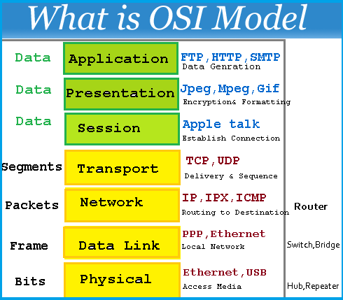

#Holberton School - 0x07-networking_basics
Answer questions based on the OSI Model

## New Commands:
``ping`` -- sends an ICMP request to a server ``netstat`` -- Displays a list of servers a machine is connected to 

## Helpful Links
* [OSI Definition](http://searchnetworking.techtarget.com/definition/OSI)
* [Lans, Wans and other Area Networks](https://www.lifewire.com/lans-wans-and-other-area-networks-817376)
* [What is a LAN?](http://searchnetworking.techtarget.com/definition/local-area-network-LAN)
* [What is a WAN](http://searchenterprisewan.techtarget.com/definition/WAN)
* [This is the Internet, according to Wikipedia](https://en.wikipedia.org/wiki/Internet)
* [What is my IP address.com on Mac Address](http://whatismyipaddress.com/mac-address)
* [The IP address explained](https://www.bleepingcomputer.com/tutorials/ip-addresses-explained/)
* [Public vs private IP Addresses](https://www.iplocation.net/public-vs-private-ip-address)
* [Difference between IPv4 and IPv6](http://www.webopedia.com/DidYouKnow/Internet/ipv6_ipv4_difference.html)
* [Wikipedia: Local Host](https://en.wikipedia.org/wiki/Localhost)
* [The Difference between TCP and UDP](http://www.howtogeek.com/190014/htg-explains-what-is-the-difference-between-tcp-and-udp/)
* [List of TCP and UDP Port Numbers](https://en.wikipedia.org/wiki/List_of_TCP_and_UDP_port_numbers)
* [Wikipedia: What is the PING utility?](https://en.wikipedia.org/wiki/Ping_(networking_utility))
* [Scripting with Posparams](http://wiki.bash-hackers.org/scripting/posparams)
* [

## Description of Files
<h6>0-OSI_model</h6>

Answers for the OSI Model

<h6>1-types_of_network</h6>
Answers for task 1

<h6>2-MAC_and_IP_address</h6>
Answers for task 2

<h6>3-UPD_and_TCP</h6>
Answers for task 3

<h6>4-TCP_and_UDP_ports</h6>
Answers for task 4

<h6>5-is_the_host_on_the_network</h6>
Answers for task 5
